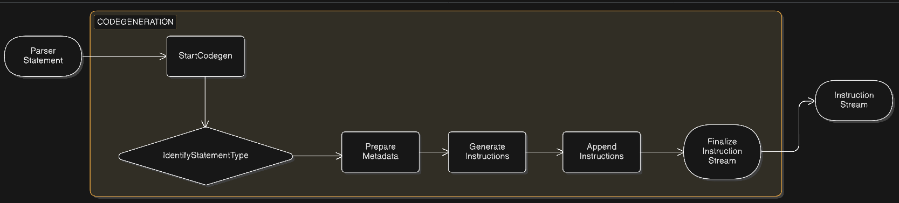

# Code Generation

After a query is parsed and converted into a structured representation, the database engine must translate it into a form that the execution engine can understand. This process is handled by the code generation stage.

The code generator converts the parsed query into a sequence of execution instructions.

### Instruction Structure

Each instruction represents a low-level operation that the query executor will perform.

Example instruction structure:

```go
type Instruction struct {
    Op    OpCode
    Value string
}

// Op → operation code (type of action to perform)

// Value → optional data required for the operation
```

### Code Generation Process

#### 1. Identify Statement Type

The generator first determines what type of statement was parsed.
Each branch corresponds to a different type of query.

Examples include:
- transaction operations  
- database operations  
- table operations  
- data manipulation queries  

#### 2. Generate Instructions

Once the statement type is identified, the generator produces one or more instructions.

For example, a transaction begin statement produces a single instruction:

```go
case *parser.BeginTxnStmt:
    instructions = append(instructions, executor.Instruction{
        Op: executor.OP_TXN_BEGIN,
    })
```

This instruction signals the executor to begin a new transaction.


#### 3. Attach Metadata

Some operations require additional information such as:

- table names
- column values
- filter conditions
- join information

This metadata is packaged into a payload.
Example for a SELECT query:
```go
payload := types.SelectPayload{
    Table:     s.Table,
    WhereCol:  s.WhereCol,
    WhereVal:  s.WhereValue,
    JoinTable: s.JoinTable,
    JoinType:  s.JoinType,
    LeftCol:   s.LeftCol,
    RightCol:  s.Rightcol,
}
```

#### 4.Emit Instructions

Instructions are appended to the instruction list in execution order.

Example for a SELECT query:  
```go
instructions = append(instructions, executor.Instruction{
    Op:    executor.OP_PUSH_VAL,
    Value: cols,
})

instructions = append(instructions, executor.Instruction{
    Op:    executor.OP_SELECT,
    Value: string(payloadJSON),
})
```

For INSERT queries, each value is first pushed to the stack before the insert operation is executed.
```go
for _, val := range s.Values {
    instructions = append(instructions, executor.Instruction{
        Op:    executor.OP_PUSH_VAL,
        Value: val,
    })
}

instructions = append(instructions, executor.Instruction{
    Op:    executor.OP_INSERT,
    Value: s.Table,
})
```

The first instruction pushes the selected columns, and the second performs the select operation.


#### 5.Finalize the Instruction Stream

Every instruction sequence ends with a special operation:

```go
instructions = append(instructions, executor.Instruction{
    Op: executor.OP_END,
})
```

This signals to the executor that the instruction stream is complete.


#### Example

SQL Query
```sql
SELECT name FROM users WHERE id = 1
```
Parsed Statement
```
SelectStmt
 ├─ Columns: name
 ├─ Table: users
 └─ Where: id = 1
```
Generated Instructions
```
OP_PUSH_VAL name
OP_SELECT {table: users, whereCol: id, whereVal: 1}
OP_END
```

These instructions are then executed by the query executor.