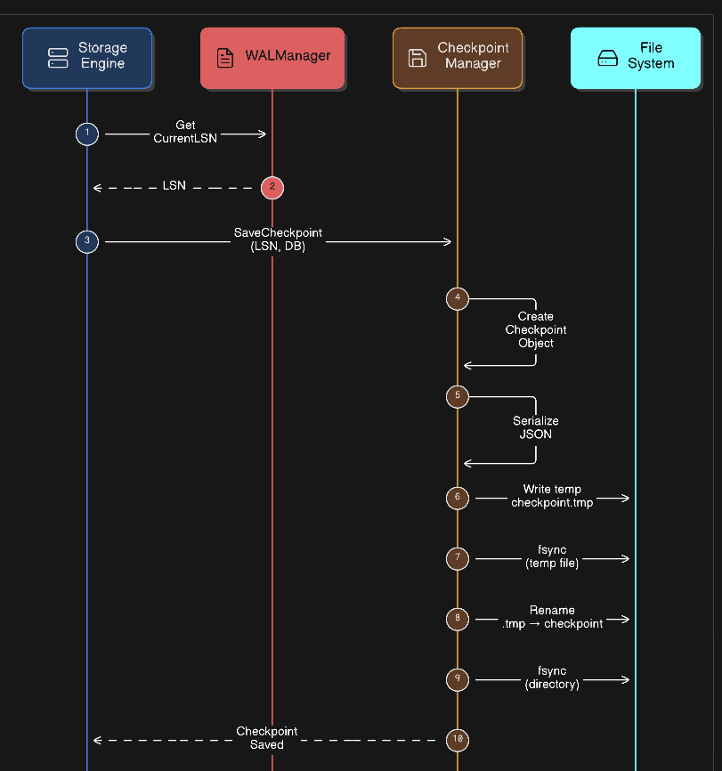

# Checkpoint Manager

The **Checkpoint Manager** is responsible for periodically saving a durable snapshot of the database state.  
It records the latest **WAL Log Sequence Number (LSN)** so that crash recovery can start from that point instead of replaying the entire WAL.

This significantly **reduces recovery time** and ensures the database can restart safely after a crash.

---



# Responsibilities

The Checkpoint Manager handles:

- Persisting the latest durable **WAL LSN**
- Recording **database metadata** for recovery
- Performing **atomic checkpoint writes**
- Loading checkpoints during database startup
- Deleting checkpoints when needed

---

# Checkpoint Structure

A checkpoint stores minimal metadata required for recovery.

```json
{
  "LSN": 10245,
  "Timestamp": 1710000000,
  "Database": "example_db"
}
```

Fields: 
- LSN:	Latest durable WAL position  
- Timestamp:	Unix time when checkpoint was created  
- Database:	Current active database  


### SaveCheckpoint()

SaveCheckpoint() persists a checkpoint safely using an atomic write pattern.

Steps

1. Acquire checkpoint manager lock.

2. Create a checkpoint structure with LSN, timestamp, and database.

3. Serialize checkpoint to JSON.

4. Write checkpoint to a temporary file.

5. Sync the temporary file to disk.

6. Atomically rename the temporary file to the actual checkpoint file.

7. Sync the directory to ensure rename durability.

8. Release the lock.

## LoadCheckpoint()

LoadCheckpoint() reads the last saved checkpoint during database startup.

Steps

1. Acquire read lock.

2. Check if checkpoint file exists.

3. If not present, return LSN = 0.

4. Read checkpoint file.

5. Deserialize JSON into checkpoint structure.

6. If file is corrupted, fallback to LSN = 0.

7. Return the checkpoint.
This ensures the database can always start safely.


## Concurrency Control

The Checkpoint Manager uses mutex locks:

- Write Lock (mu.Lock) for saving or deleting checkpoints

- Read Lock (mu.RLock) for loading checkpoints

This prevents race conditions between checkpoint operations.