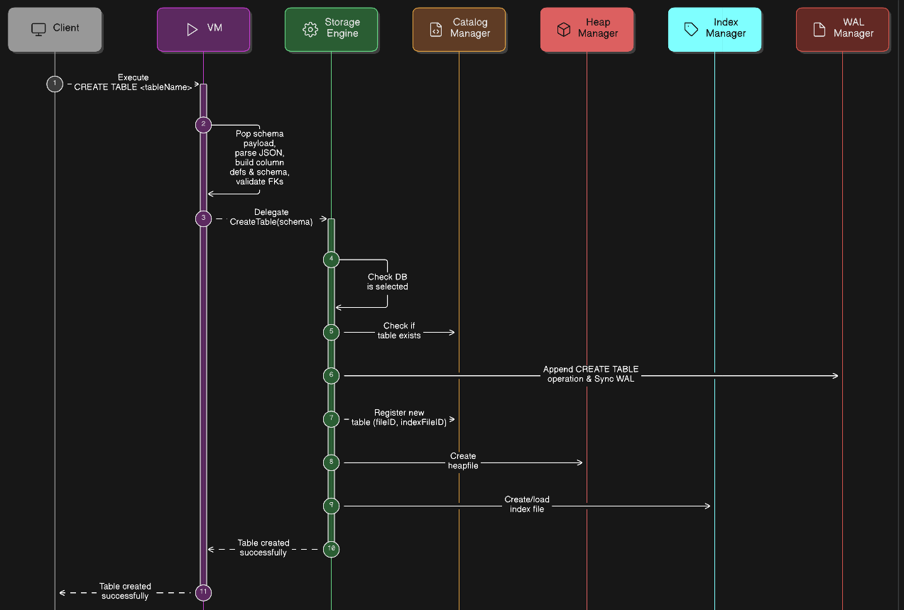

# CREATE TABLE Flow – Storage Engine

This diagram represents the **high-level sequence of operations** when a `CREATE TABLE` command is executed in the database system. It shows interactions between the **Client**, **VM (Virtual Machine)**, **StorageEngine**, **CatalogManager**, **HeapManager**, **IndexManager**, and **WALManager**.

---

## Flow Steps

1. **Client sends `CREATE TABLE` command**  
   The request is received by the VM for execution.

2. **VM parses and validates schema**  
   - Pops schema payload from the stack  
   - Parses JSON payload  
   - Builds column definitions  
   - Validates foreign key constraints

3. **VM delegates to StorageEngine**  
   Passes the validated schema to the StorageEngine for persistence.

4. **StorageEngine checks database context**  
   Ensures a database is currently selected.

5. **CatalogManager checks table existence**  
   Prevents duplicate table creation.

6. **WALManager logs operation**  
   Appends a `CREATE TABLE` operation to the Write-Ahead Log and syncs to disk to ensure durability.

7. **CatalogManager registers new table**  
   Allocates unique `fileID` and `indexFileID`, updates table-to-file mapping.

8. **HeapManager creates heapfile**  
   Prepares storage for table data.

9. **IndexManager creates or loads index file**  
   Supports fast lookups and ensures index consistency.

10. **StorageEngine returns success**  
    The table creation is successfully persisted.

11. **VM informs Client**  
    Client receives confirmation that the table has been created successfully.

This sequence ensures that a table is created **atomically, durably, and correctly** with all associated metadata, heapfile, index, and WAL entries in place.