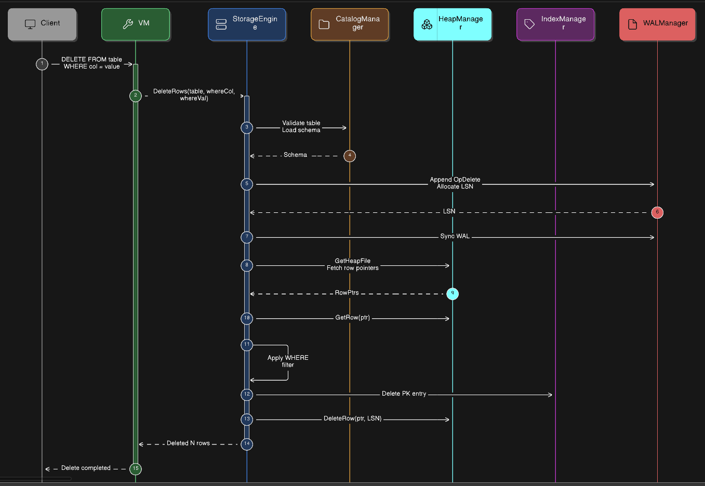

# DELETE Operation

The `DELETE` command removes rows from a table that satisfy a given `WHERE` condition.  
In **DaemonDB**, the request is first handled by the **VM (Virtual Machine)** layer, which validates the query and forwards it to the **StorageEngine** for physical row deletion.

The delete flow ensures:

- Table validation
- Row scanning
- Conditional filtering
- Heap row deletion
- Index cleanup
- WAL logging for durability

---



# Workflow

## 1. Client Request

The client issues a `DELETE` statement specifying:

- Target table
- Optional `WHERE` condition

Example: 
```sql
DELETE FROM users
WHERE id = 5
```

The request is forwarded to the **VM execution layer**.

---

# 2. VM Processing

The **VM** validates the query before delegating it to the storage engine.

Steps:

1. Ensure the **storage engine is initialized**.
2. Verify that a **database is selected**.
3. Validate that the **table exists**.
4. If a `WHERE` column is provided, ensure the **column exists in the table schema**.
5. Call the storage engine: ```StorageEngine.DeleteRows(table, whereCol, whereVal)```

---

# 3. Storage Engine Delete

The `StorageEngine.DeleteRows()` function performs the physical deletion of rows.

Steps:

#### 1. Load Schema
Retrieve the table schema from the **CatalogManager**.

#### 2. Write WAL Record
Append a `DELETE` operation to the **Write-Ahead Log** and allocate an **LSN**.

#### 3. Sync WAL
Ensure the WAL entry is persisted to disk for durability.

#### 4. Fetch Heap Rows
Retrieve all row pointers from the table's heap file.

#### 5. Scan Rows
Iterate through each row and deserialize its values.

#### 6. Apply WHERE Filter
If a `WHERE` clause exists, only rows matching the condition are processed.

#### 7. Remove Index Entry
Delete the corresponding primary key entry from the **B+Tree index**.

#### 8. Delete Heap Row
Mark the row as deleted in the heap file using the allocated **LSN**.

---