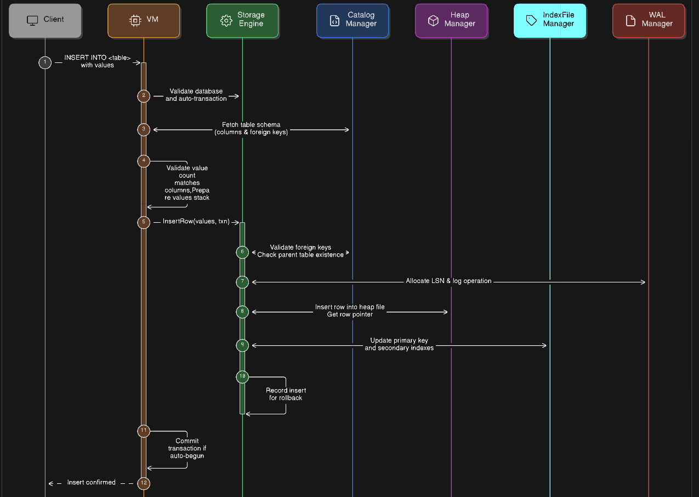

# INSERT Row Flow – Storage Engine

This diagram represents the **high-level sequence of operations** when an `INSERT` command is executed in the database system. It shows interactions between the **Client**, **VM**, **StorageEngine**, **CatalogManager**, **HeapManager**, **IndexManager**, and **WALManager**.

## Flow Steps

1. **Client sends `INSERT` command**  
   Includes table name and values.

2. **VM validates database context**  
   Ensures a database is selected.

3. **VM fetches table schema**  
   Retrieves table columns and foreign key definitions from CatalogManager.

4. **VM validates stack size and values**  
   Ensures number of values matches the number of table columns.

5. **VM starts auto-transaction if needed**  
   Automatically begins a transaction if one is not already active.

6. **StorageEngine validates foreign keys**  
   Checks that all referenced values exist in parent tables.

7. **StorageEngine serializes row**  
   Converts row data into binary format for storage.

8. **WALManager logs the operation**  
   Allocates LSN and appends operation to WAL buffer.

9. **HeapManager inserts row**  
   Writes row data to the heap file and returns a row pointer.

10. **IndexManager updates indexes**  
    Updates primary key index and any additional indexes using the row pointer.

11. **Transaction records insert**  
    The transaction logs the insertion to support rollback if necessary.

12. **VM commits transaction if auto-begun**  
    Finalizes the insert, making it durable.

13. **Client receives confirmation**  
    Insert operation is successfully persisted.

This flow ensures that an insert operation is **validated, durable, and consistent** across heap storage, indexes, and the WAL.