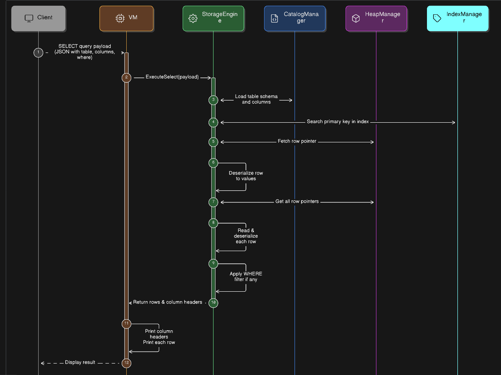
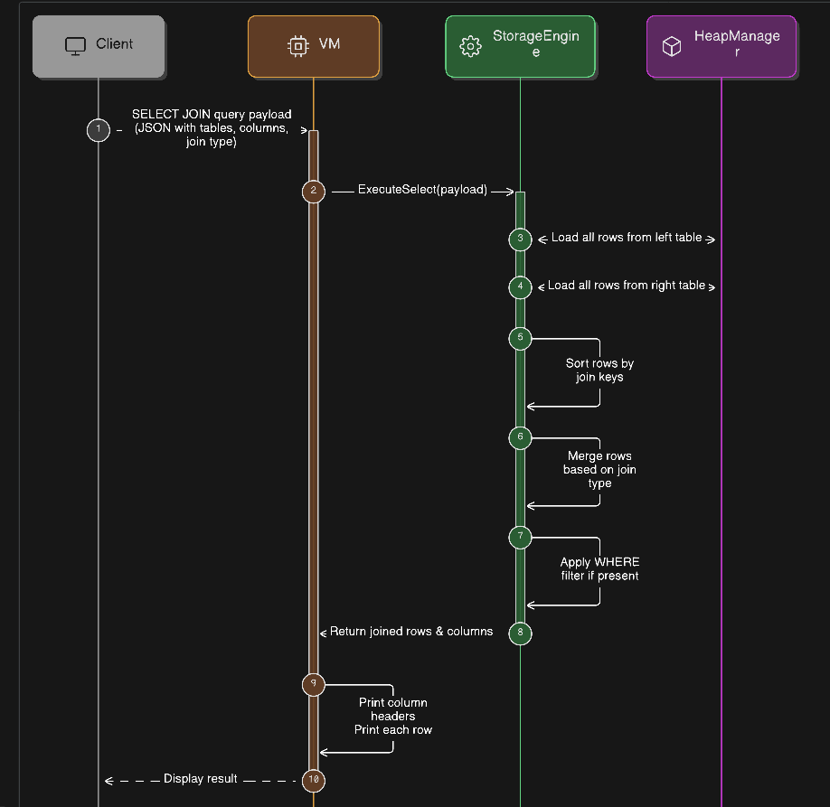

# SELECT Queries in DaemonDB

DaemonDB provides support for read-only queries via the `SELECT` command.  
The execution is handled by the `VM` (Virtual Machine) which interacts with the `StorageEngine`.  

There are two main types of SELECT queries:

1. **Normal SELECT** – for single-table queries.  
  

2. **JOIN SELECT** – for multi-table queries with joins.

---

## 1. Normal SELECT Flow

This flow handles queries on a single table. It may perform a **primary key lookup** if the `WHERE` clause specifies a primary key, or a **full table scan** otherwise.

**Steps:**

1. **Client** sends a `SELECT` query payload (JSON) to the **VM**.  
2. **VM** calls `StorageEngine.ExecuteSelect(payload)`.  
3. **StorageEngine** requests the table schema and columns from **CatalogManager**.  
4. **Primary Key Lookup (optional)**:
   - **IndexManager** searches for the row pointer.  
   - **HeapManager** fetches the row.  
   - Row is deserialized into values.  
5. **Full Table Scan (if not PK)**:
   - **HeapManager** returns all row pointers.  
   - **StorageEngine** reads and deserializes each row.  
   - Applies any WHERE filter.  
6. **StorageEngine** returns the resulting rows and column headers to **VM**.  
7. **VM** prints the column headers and row data, then displays it to the **Client**.  

**Notes:**

- Single-table SELECT does **not require transactions** since it is read-only.  

---

## 2. JOIN SELECT Flow

This flow handles queries involving multiple tables. It supports **INNER, LEFT, RIGHT, and FULL joins**.

**Steps:**

1. **Client** sends a `SELECT JOIN` payload (JSON) to the **VM**.  
2. **VM** calls `StorageEngine.ExecuteSelect(payload)`.  
3. **StorageEngine** loads all rows from the **left table** via **HeapManager**.  
4. **StorageEngine** loads all rows from the **right table** via **HeapManager**.  
5. Rows from both tables are **sorted by join keys**.  
6. **Merge Join** is performed based on the join type:
   - INNER, LEFT, RIGHT, FULL.  
7. **WHERE filter** is applied if present.  
8. **StorageEngine** returns the joined rows and column headers to **VM**.  
9. **VM** prints the results and displays them to the **Client**.  

**Notes:**

- JOIN SELECT does **not use transactions** since it only reads data.  
- Column names are prefixed with table names to avoid ambiguity.  
- Join types determine which rows are included in the result (matching or unmatched rows).  

---

These flows ensure **efficient data retrieval** while maintaining separation of concerns between the **VM**, **StorageEngine**, **CatalogManager**, **HeapManager**, and **IndexManager**.