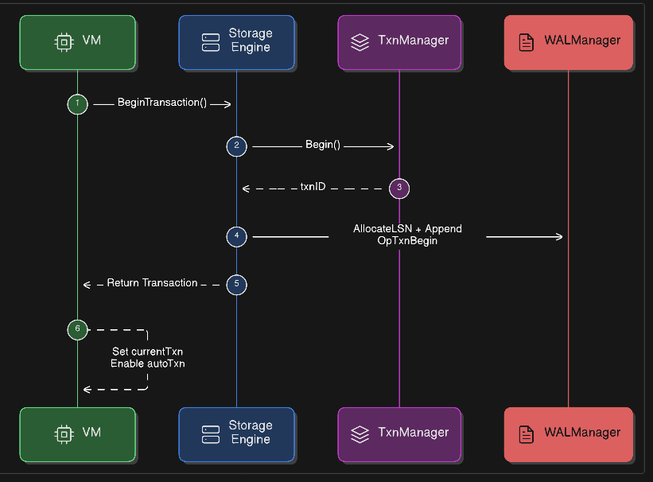
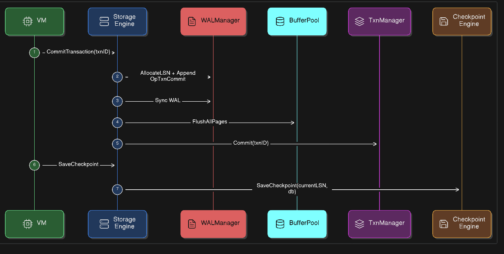
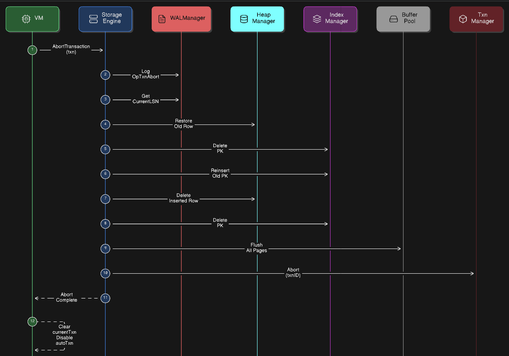

# Transaction Flow

DaemonDB manages transactions through the **StorageEngine**, which coordinates:

- Transaction Manager
- WAL Manager
- Buffer Pool
- Heap Storage
- Index Manager

All transaction boundaries are logged in the **Write-Ahead Log (WAL)** to ensure durability and crash recovery.

---

# Transaction Lifecycle

## 1. Begin Transaction

A transaction starts when the VM calls `BeginTransaction()`.

Steps:

1. TransactionManager creates a new transaction ID.
2. StorageEngine logs `OpTxnBegin` in WAL.
3. WAL entry is appended to the WAL buffer.
4. Transaction handle is returned to the VM.

---

## 2. Commit Transaction

Commit finalizes all changes performed by the transaction.

Steps:

1. StorageEngine logs `OpTxnCommit` to WAL.
2. WAL is **synced to disk (fsync)**.
3. Buffer pool flushes dirty pages to disk.
4. TransactionManager marks the transaction as **committed**.
5. Optional checkpoint may be triggered.

Durability guarantee:  
Once WAL is synced, the transaction is considered **durable**.

---

## 3. Abort Transaction (Rollback)

If a transaction fails, all changes are reversed.

Steps:

1. StorageEngine logs `OpTxnAbort` to WAL.
2. Undo **updated rows** in reverse order.
3. Restore old row data in heap storage.
4. Restore index entries.
5. Undo **inserted rows** by deleting them.
6. Flush buffer pool pages.
7. TransactionManager marks the transaction as **aborted**.

Rollback order is **LIFO (Last Update First)** to maintain consistency.

---

## 4. Checkpoint

A checkpoint saves the current database state to reduce recovery time.

Steps:

1. Retrieve current WAL LSN.
2. Store checkpoint metadata.
3. Persist database state reference.

Checkpoints may occur:

- after transactions
- periodically
- after WAL size threshold

---
