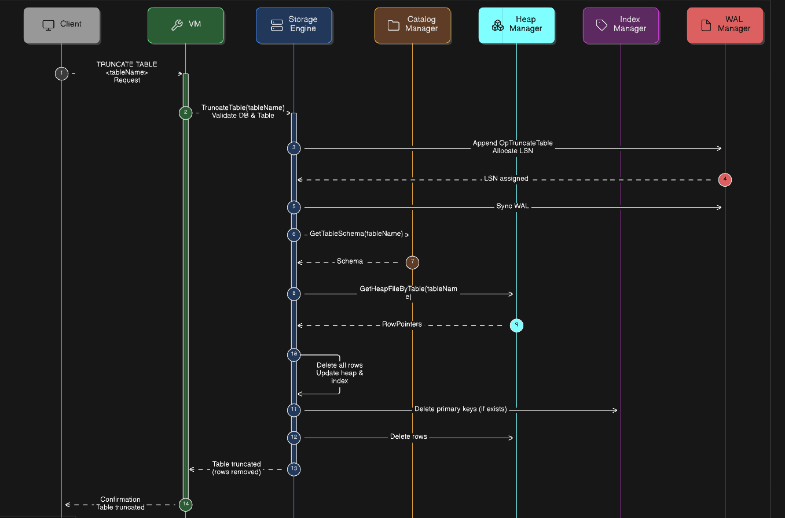

# TRUNCATE TABLE

The `TRUNCATE TABLE` command removes all rows from a table efficiently while maintaining the table schema and indexes. This operation is **logged** in the Write-Ahead Log (WAL) to ensure durability and recoverability.  

Unlike `DELETE`, `TRUNCATE` does not scan rows individually for filtering; it directly clears the table’s heap file and updates associated indexes.

---

## Workflow

1. **Client Request**
   - The client sends a `TRUNCATE TABLE <tableName>` command to the VM.

2. **VM Validation**
   - Checks if a database is selected.
   - Validates that the table name is not empty.
   - Passes the truncate request to the `StorageEngine`.

3. **Storage Engine Operations**
   - **Validate Database & Table**: Ensures the database is selected and the table exists.
   - **WAL Logging**: 
     - Appends an `OpTruncateTable` operation to the WAL.
     - Allocates a Log Sequence Number (LSN).
     - Syncs WAL to disk for durability.
   - **Load Schema**: Fetches table schema from `CatalogManager`.
   - **Fetch Heap File**: Retrieves the heap file for the table from `HeapManager`.
   - **Row & Index Deletion**:
     - Iterates over all row pointers in the heap file.
     - Deletes corresponding primary key entries from the index if it exists.
     - Deletes rows from the heap file.

4. **Completion**
   - Returns a confirmation to the VM including the number of rows removed.
   - VM forwards confirmation to the client.

---

## Notes

- Truncate is **all-or-nothing**: either all rows are removed, or none in case of failure.
- The operation is **fast and efficient** because it directly manipulates heap files and indexes rather than performing row-by-row deletion.
- WAL ensures **recoverability** in case of crashes.