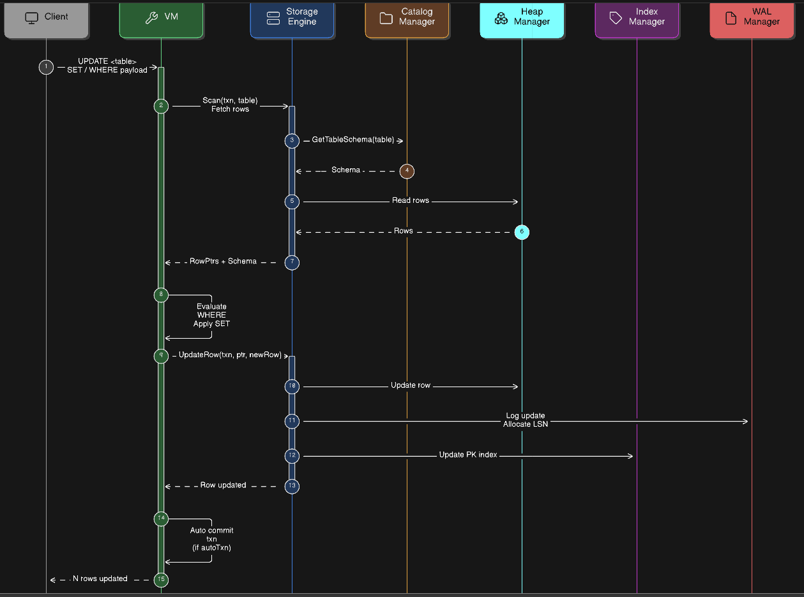

# UPDATE Operation

The `UPDATE` command modifies existing rows in a table based on a specified `WHERE` condition.  
DaemonDB processes the update through the **VM (Virtual Machine)** layer, which interprets the query payload and coordinates with the **StorageEngine** to safely update rows while maintaining durability and index consistency.
 
---




# Workflow

## 1. Client Request

The client sends an `UPDATE` statement containing:

- Target table
- `SET` expressions
- Optional `WHERE` condition

The query is converted into a **JSON payload** and pushed onto the VM stack.

Example:
```sql
UPDATE users
SET age = 30
WHERE id = 5
```

## 2. VM Processing

The **VM** is responsible for query-level execution and transaction handling.

Steps performed by the VM:
1. Ensure a database is selected using RequireDatabase().
2. Pop and deserialize the update payload from the stack.
3. Start an auto transaction if none is active.
4. Request rows from the StorageEngine using: Scan(txn, tableName)
5. Iterate through returned rows.
6. Evaluate the WHERE condition for each row.
7. For matching rows:

    - Clone the row

    - Apply SET expressions

    - Call StorageEngine.UpdateRow().

After processing all rows:
Auto-commit the transaction if it was automatically started.

Return the number of updated rows to the client.

## 3. Storage Engine Update

- **Load Schema:** Retrieve the table schema from the `CatalogManager` to ensure correct column structure and types.

- **Read Existing Row:** Fetch the current row from the `HeapManager` to capture the old data for rollback and index handling.

- **Serialize Updated Row:** Convert the modified row into the database's binary storage format.

- **Allocate WAL LSN:** Generate a Log Sequence Number (LSN) using `WalManager.AllocateLSN()` to track the update in the WAL.

- **Update Heap Storage:** Write the serialized row into the heap file using `HeapManager.UpdateRow()`.

- **Write WAL Record:** Append the update operation to the WAL buffer via `WalManager.AppendToBuffer()` for durability.

- **Update Index:** Update the primary key index by deleting the old entry (if needed) and inserting the new one.

- **Record Undo Information:** Store the previous row state in the transaction log using `txn.RecordUpdate()` to support rollback.