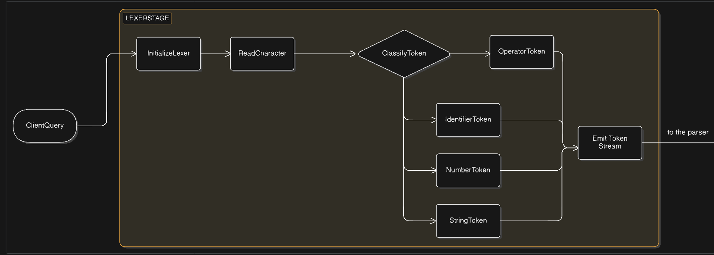
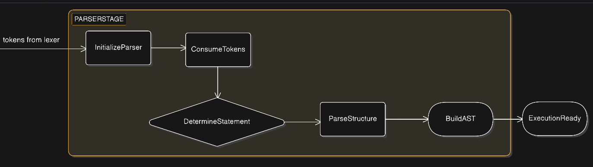

# Query Parser
This section describes how a query moves through the query parsing pipeline of the database engine. The system converts a raw query string into a structured representation that can later be executed by the query engine.

The process consists of two main stages:

- Lexical Analysis (Lexer)
  

- Parsing (Parser)



## 1. Query Input

The process begins when a client submits a query as a raw string.
Example:
```sql
SELECT name FROM users WHERE id = 1
```

This is first broken down into meaningful components.

## 2. Lexical Analysis (Lexer)

The lexer scans the input query character by character and converts it into a sequence of tokens.

A token represents a meaningful unit such as:

- keywords (SELECT, INSERT, DELETE)
- identifiers (users, name)
- operators (=, +, -)
- literals (1, "John")
- punctuation (( ) ,)

### Lexer Responsibilities
The lexer performs the following steps:
- 1.Initialize the lexer
- 2.Read characters sequentially
- 3.Skip whitespace
- 4.Classify characters into token types
- 5.Emit tokens  

Example Input query:
```sql
SELECT name FROM users
```

Generated tokens:
```
SELECT
IDENT(name)
FROM
IDENT(users)
END
```

These tokens are then passed to the parser.


## 3.Parsing

The parser reads the token stream and verifies that the sequence follows the database query grammar.

Its main goals are:

- Validate syntax
- Determine the statement type
- Construct a structured representation of the query

### Parser Responsibilities

- 1.Initialize the parser
- 2.Consume tokens sequentially
- 3.Determine the type of statement
- 4.Parse the statement structure
- 5.Construct an Abstract Syntax Tree (AST)

### Statement Detection

The parser first determines what type of query is being executed.

Examples include:
```
CREATE DATABASE
CREATE TABLE
INSERT
SELECT
UPDATE
DELETE
DROP
TRUNCATE
USE
```

Once the statement type is detected, the parser invokes the appropriate parsing logic.

### Abstract Syntax Tree (AST)

The final output of the parser is a structured representation of the query known as the Abstract Syntax Tree (AST).

The AST captures the semantic structure of the query.

Example Query:

```sql
SELECT name FROM users WHERE id = 1
```

```
AST representation (conceptual):

SelectStatement
 ├─ Columns: name
 ├─ Table: users
 └─ Where:
     ├─ Column: id
     └─ Value: 1
```

This structured representation allows the execution engine to easily interpret the query.

### Query Ready for Execution

Once the AST is built, the query is considered syntactically valid and fully parsed.

The AST can now be passed to the next stage of the database system:

- Query Planner

- Execution Engine

- Storage Engine

These components will evaluate the query and interact with the database storage layer.