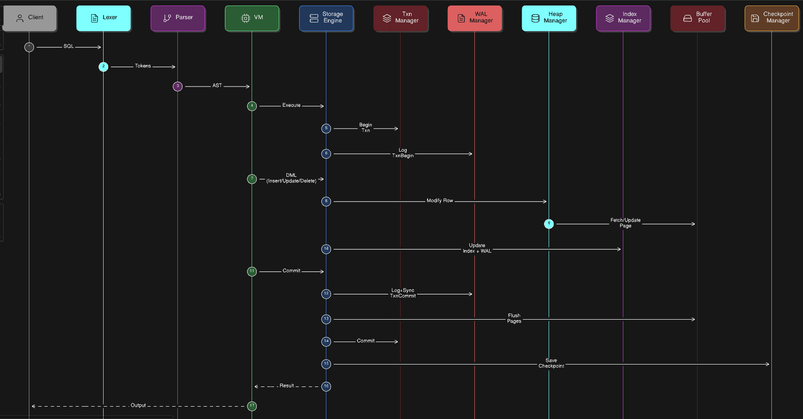

# DaemonDB

DaemonDB is a lightweight relational database engine designed to demonstrate how core database systems work internally.  
It implements a simplified but realistic architecture including **query parsing, a virtual machine execution layer, transaction management, write-ahead logging, buffer management, indexing, and checkpoint-based crash recovery**.

The goal of this project is to provide a clear and educational implementation of modern database internals while maintaining a modular architecture.

---



# Architecture Overview

DaemonDB is divided into several layers:

```
Client
↓
Lexer → Parser → Virtual Machine (VM)
↓
Storage Engine
↓
TxnManager | WALManager | HeapManager | IndexManager | BufferPool | CheckpointManager
```

Each component focuses on a specific responsibility while interacting with others to execute queries safely and efficiently.

---

# System Components

## Client

The client submits SQL queries to the database.

Example:

```sql
INSERT INTO users VALUES (1, "Alice");
SELECT * FROM users;
```

The query is passed through the processing pipeline for execution.

## Query Processing Layer
### Lexer

The Lexer converts the SQL query string into tokens.

Example query:
```sql
SELECT * FROM users
```

Tokenized form:
```sql
SELECT | * | FROM | users
```

#### Responsibilities

- Break SQL text into tokens

- Handle whitespace and delimiters

- Provide tokens for the parser

### Parser

The Parser converts tokens into an Abstract Syntax Tree (AST).

Example AST:

```
SelectStatement
 ├── Columns: *
 └── Table: users
```

#### Responsibilities

- Validate SQL syntax

- Build AST representation

- Pass execution plan to the VM

## Execution Layer
### Virtual Machine (VM)

The VM executes parsed queries.

It translates AST operations into storage engine commands.

Example operations:

```
INSERT → StorageEngine.InsertRow()
SELECT → StorageEngine.ReadRow()
UPDATE → StorageEngine.UpdateRow()
DELETE → StorageEngine.DeleteRow()
```

The VM also manages automatic transactions:

```
BEGIN
   execute statement
COMMIT
```

## Storage Layer

The Storage Engine coordinates all persistence-related operations.

It interacts with:


- Transaction Manager

- WAL Manager

- Heap Storage

- Index Storage

- Buffer Pool

- Checkpoint Manager

#### Responsibilities

- Execute data operations

- Ensure durability

- Coordinate transaction lifecycle


## Transaction Manager

The TxnManager tracks transaction states.

Transaction states include:

```
ACTIVE
COMMITTED
ABORTED
```

#### Responsibilities

- Assign transaction ID

- Track active transaction

- Mark transactions committed or aborted

Example flow:

```go
BeginTransaction()
Commit(txnID)
Abort(txnID)
```

## Write-Ahead Logging (WAL)
The WAL Manager ensures durability using Write-Ahead Logging.

Before modifying any data page, the operation is recorded in the WAL.

Example log entries:

```go
TxnBegin
InsertRow
UpdateRow
DeleteRow
TxnCommit
TxnAbort
```

#### Responsibilities

- Allocate log sequence numbers (LSN)

- Append log records

- Sync logs to disk

- Enable crash recovery

- Durability rule: WAL must be written before data pages are flushed.


## Buffer Pool

The Buffer Pool caches database pages in memory.

Instead of reading from disk every time, pages are stored in memory for faster access.

#### Responsibilities

- Fetch pages from disk

- Cache pages

- Track dirty pages

- Flush modified pages to disk

Typical operations:

```go
FetchPage()
MarkDirty()
FlushPage()
FlushAllPages()
```

## Heap Manager

The Heap Manager handles row storage inside heap files.

#### Responsibilities

- Insert rows

- Update rows

- Delete rows

- Locate rows by page and slot

Row pointers typically contain:

```go
PageNumber
SlotIndex
```

## Index Manager

Indexes accelerate data access.

The Index Manager maintains mappings between keys and row pointers.

#### Responsibilities
- Insert key

- Delete key

- Search key

- Update index entries


Example mapping:
```go
PrimaryKey → RowPointer
```

Indexes must stay consistent with heap storage.

## Checkpoint Manager

Checkpoints provide a recovery boundary.

Instead of replaying the entire WAL during crash recovery, the system starts replaying from the latest checkpoint LSN.

A checkpoint stores:

```
LSN
Timestamp
Database
```

#### Atomic Checkpoint Writes
To prevent corruption, checkpoints use an atomic write pattern:

```
checkpoint.tmp
      ↓
fsync(temp file)
      ↓
rename(temp → checkpoint)
      ↓
fsync(directory)
```

This guarantees that the checkpoint file is never partially written.


When the database restarts:

```
LoadCheckpoint()
       ↓
Find checkpoint LSN
       ↓
Replay WAL from LSN
       ↓
Restore database state
```

This ensures that: committed transactions are preserved and incomplete transactions are rolled back