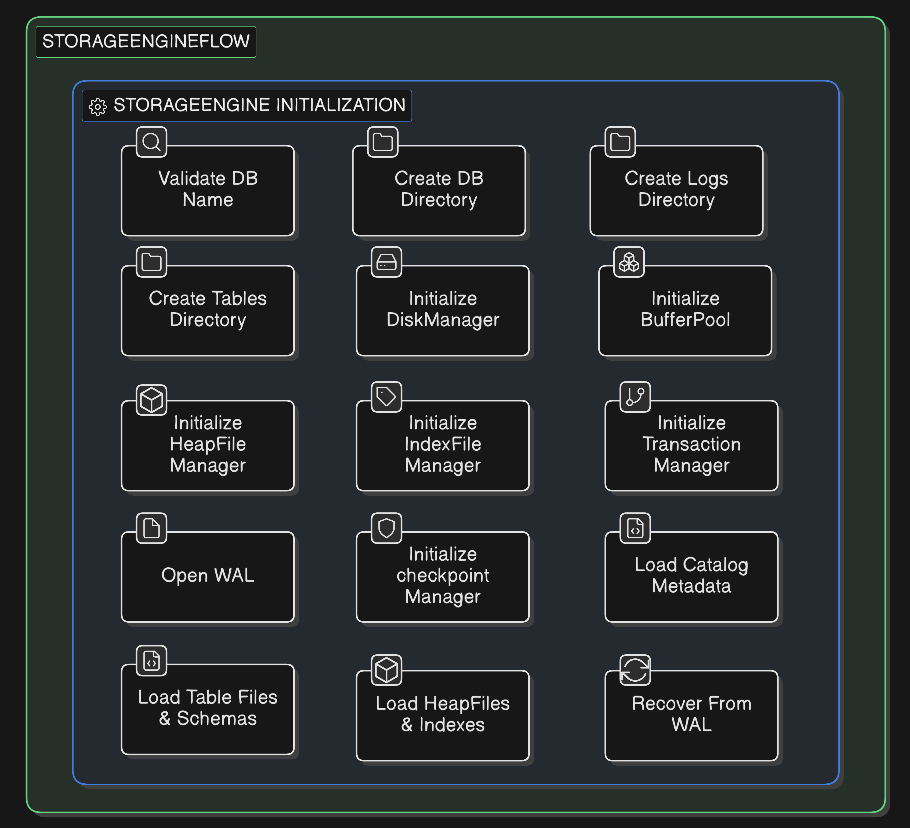

# Storage Engine Initialization Flow - DaemonDB

This document explains the **storage engine initialization process** in DaemonDB, detailing each step performed when a database is created or selected using the `UseDatabase` command.

---

## Step-by-Step Initialization

### 1. Validate DB Name
- Ensures the database name is **not empty**.
- Prevents illegal operations or undefined behavior.
- If invalid, returns an error: `"database name cannot be empty"`.

### 2. Create DB Directory
- Creates the main folder for the database inside the root DB directory.
- Checks if the directory already exists to prevent overwriting.
- Example path: `<DB_ROOT>/<db_name>`.

### 3. Create Logs Directory
- Creates a folder to store **Write-Ahead Logs (WAL)**.
- WAL ensures **durable writes** and supports crash recovery.
- Example path: `<DB_ROOT>/<db_name>/logs`.

### 4. Create Tables Directory
- Creates the directory for **table heap files**.
- Prepares the storage structure for table data.
- Example path: `<DB_ROOT>/<db_name>/tables`.

### 5. Initialize DiskManager
- Handles **low-level file operations**:
  - Open, read, write, close files.
  - Allocate pages on disk.
- Provides the foundation for all higher-level storage operations.

### 6. Initialize BufferPool
- Manages **in-memory caching** of pages from disk.
- Improves performance by reducing disk I/O.
- Configurable for capacity and eviction debugging.
- Works in conjunction with the DiskManager.

### 7. Initialize HeapFileManager
- Manages **heap files**, which store table data.
- Handles reading, writing, and creating pages for tables.
- Uses BufferPool for caching and DiskManager for file access.

### 8. Initialize IndexFileManager
- Manages **indexes** to support fast lookups.
- Creates or loads B+-tree index files for tables.
- Works alongside HeapFileManager to maintain data consistency.

### 9. Open WAL
- Opens the **Write-Ahead Log**.
- All operations are appended to WAL to ensure **durability**.
- Supports recovery after crashes by replaying logged operations.

### 10. Initialize TransactionManager
- Handles **transactions** (ACID compliance):
  - Begin, commit, rollback.
- Manages concurrency and isolation between operations.

### 11. Initialize CheckpointManager
- Manages **periodic checkpoints** of the database state.
- Reduces recovery time by allowing WAL replay from the last checkpoint instead of the beginning.

### 12. Load Catalog Metadata
- Loads database **schema metadata**:
  - Tables
  - Columns
  - Foreign keys
- CatalogManager maintains a **table-to-file mapping** for efficient access.

### 13. Load Table Files & Schemas
- Loads all **table schemas** from disk.
- Prepares the storage engine for **query execution**.

### 14. Load HeapFiles & Indexes
- Loads **heap files** containing table data.
- Loads or creates **index files** for fast access.

### 15. Recover From WAL
- Replays operations from WAL after a crash or restart.
- Ensures the database is **consistent and durable**.
- Handles **aborted operations**, incomplete writes, and crash recovery.